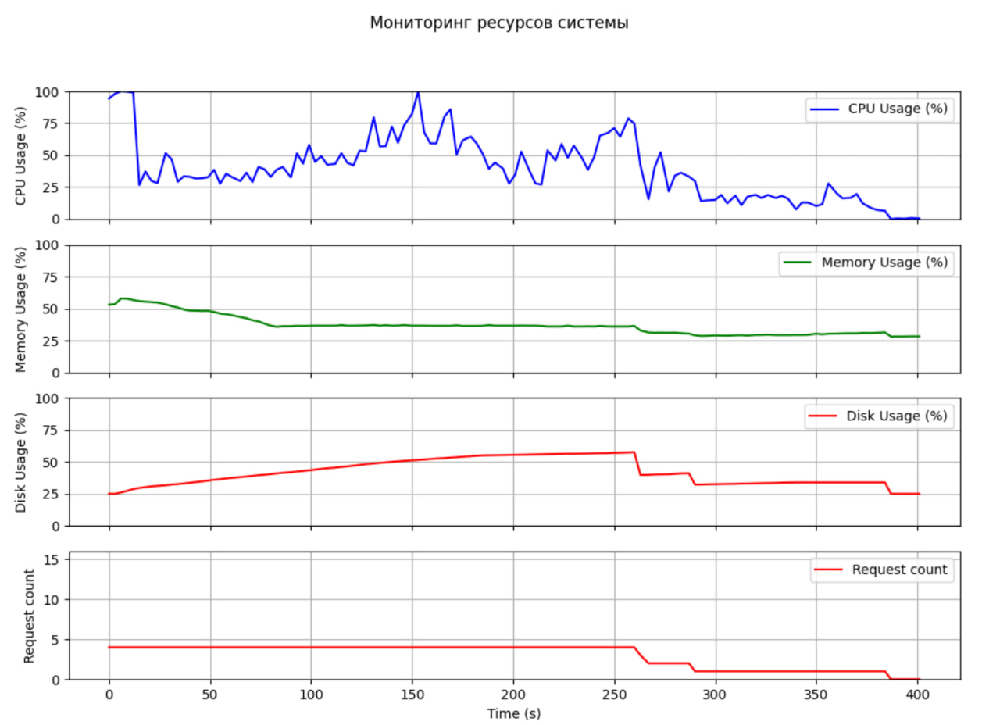
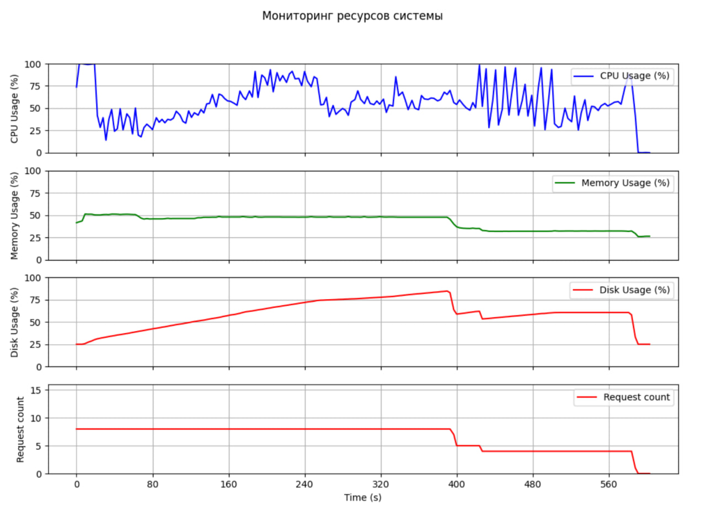
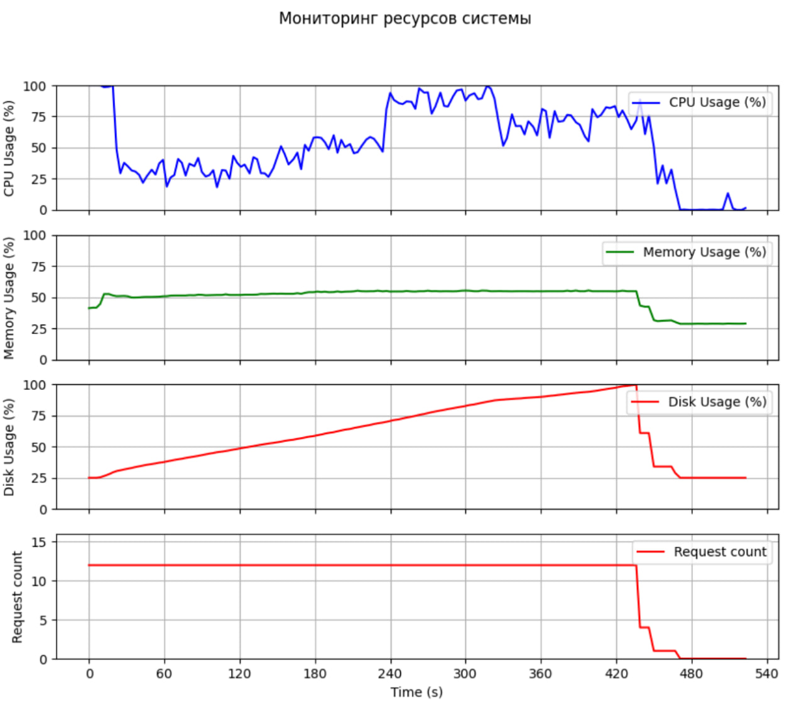
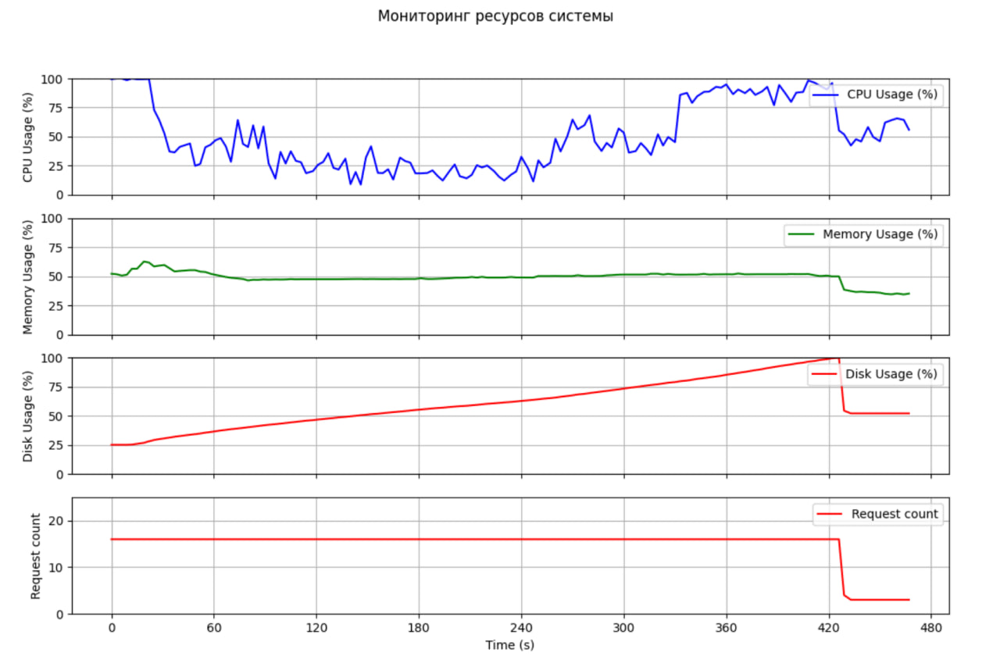

# Зависимость использования ресурсов от подключений к PostgreSQL

Этот репозиторий содержит демонстрацию того, как использование системных ресурсов изменяется в зависимости от количества активных подключений к PostgreSQL. Проект измеряет и визуализирует влияние различного числа подключений на загрузку процессора, использование памяти, диска и количество запросов.

## Содержание

- [Введение](#введение)
- [Требования](#требования)
- [Установка](#установка)
- [Использование](#использование)
- [Результаты](#результаты)


## Введение

Эффективное управление ресурсами критически важно при работе с базами данных, такими как PostgreSQL. Этот проект демонстрирует, как увеличение числа активных подключений влияет на использование системных ресурсов. Анализ результатов поможет пользователям лучше понять и оптимизировать конфигурацию базы данных.

## Требования

Перед использованием этого репозитория убедитесь, что у вас установлено следующее:

- Python версии 3.8 или выше
- PostgreSQL
- Необходимые Python-библиотеки (указаны в `requirements.txt`)

## Установка

1. Клонируйте репозиторий:

   ```bash
   git clone https://github.com/mbiuib/Resource-dependence-on-PostgreSQL-connections.git
   cd Resource-dependence-on-PostgreSQL-connections
   ```

2. Установите необходимые пакеты:

   ```bash
   pip install -r requirements.txt
   ```

3. Настройте подключение к базе данных PostgreSQL в предоставленном скрипте.

## Использование

1. Запустите основной скрипт для начала мониторинга использования ресурсов:

   ```bash
   python main.py
   ```

2. Изменяйте количество подключений к PostgreSQL в скрипте и интерактивно, чтобы наблюдать изменения в использовании ресурсов.

## Результаты

Проект создает визуализации использования системных ресурсов. Ниже представлены примеры графиков:

### Примеры графиков

#### Загрузка процессора, использование памяти, диска и количество запросов с течением времени






Эти графики демонстрируют, как системные ресурсы используются при различных уровнях активности PostgreSQL.
